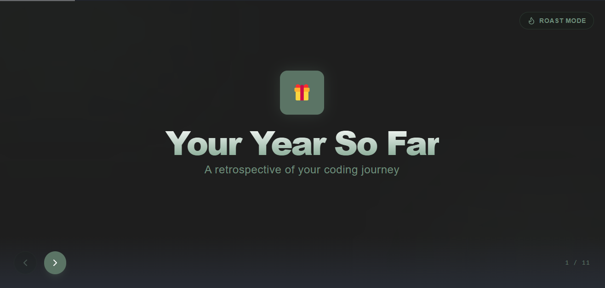
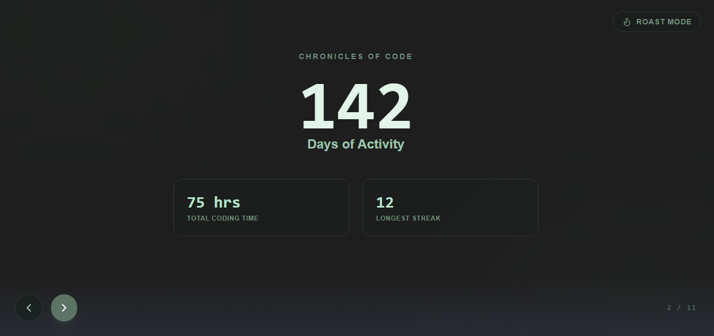
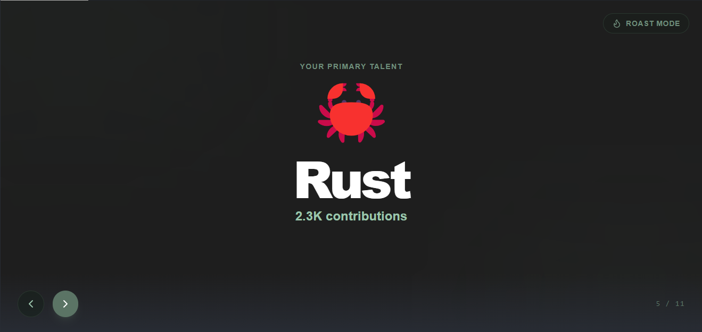
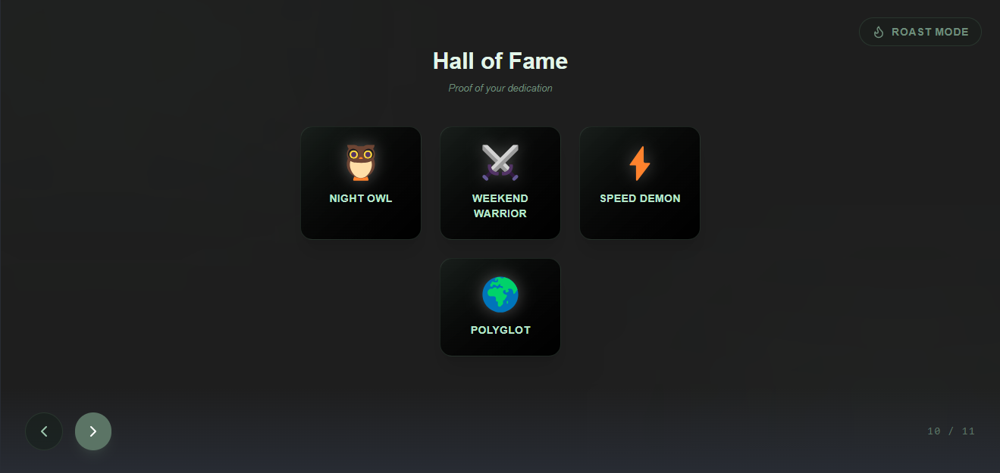
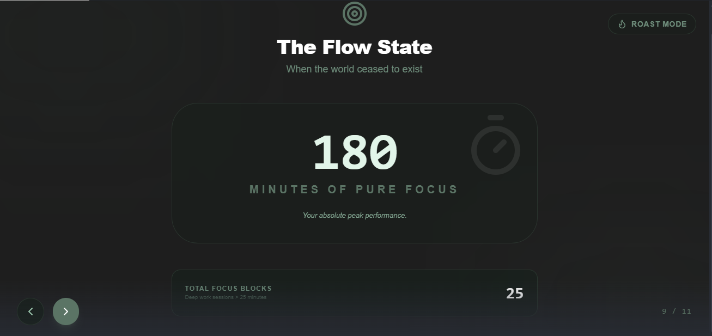
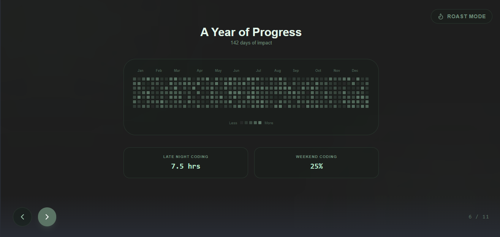
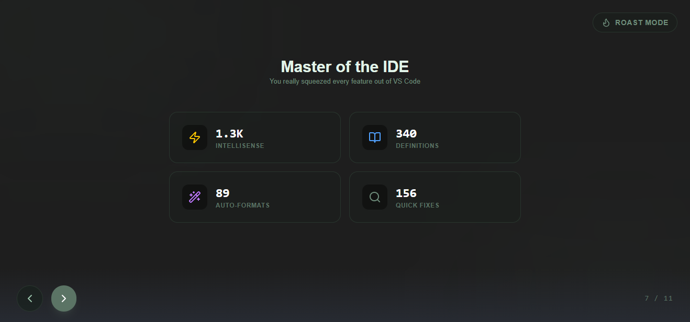
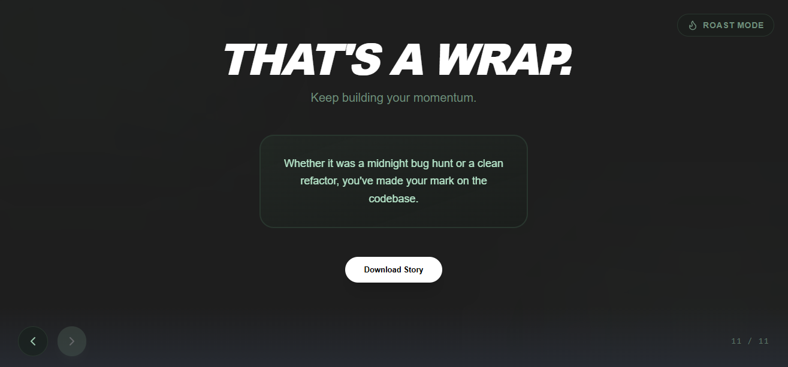
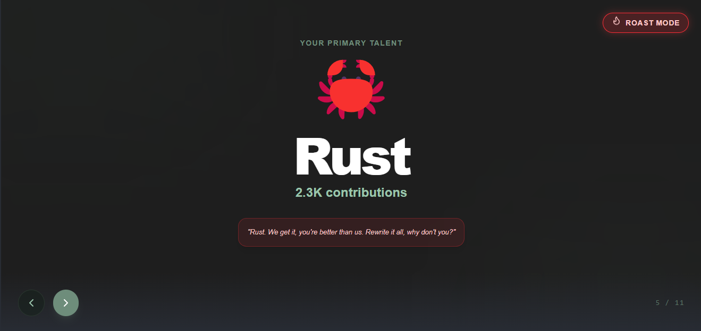
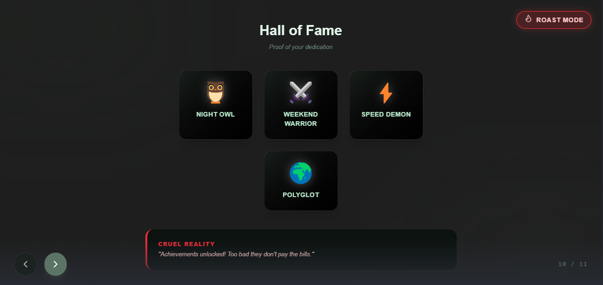

# VS Code Wrapped

A beautiful, local-first "Spotify Wrapped" style recap for your coding activity.

## Recap Gallery

| **Intro** | **Activity Heatmap** | **Top Language** | **Hall of Fame** |
| :---: | :---: | :---: | :---: |
|  |  |  |  |

| **Focus Blocks** | **Productivity** | **IDE Stats** | **Closing Summary** |
| :---: | :---: | :---: | :---: |
|  |  |  |  |

### **Roast Mode (Sarcastic AI Analytics)**

| **Language Roast** | **Hall of Fame Roast** |
| :---: | :---: |
|  |  |

## Features

- **Personalized Recap**: View your total coding time, most productive hours, and favorite languages.
- **Activity Heatmap**: A GitHub-style intensity grid showing your consistency throughout the year.
- **Roast Mode**: Toggle a sarcastic AI persona to mock your coding habits.
- **Privacy First**: All data is collected and stored locally on your machine. No telemetry is sent to any servers.
- **JSON Export**: Export your year in code as a clean JSON file for your portfolio.

## Usage

1. Open the Command Palette (`Ctrl+Shift+P` / `Cmd+Shift+P`).
2. Type **"VS Code Wrapped: Show Stats"**.
3. Scroll through your journey!

## Installation

Install via the [VS Code Marketplace](https://marketplace.visualstudio.com/items?itemName=beamlakfekad.vscode-wrapped).
Also available on cursor and antigravity [Open VSX Registry](https://open-vsx.org/extension/beamlakfekad/vscode-wrapped).

## Support

If you enjoy this extension, please give it a rating and leave a review!
